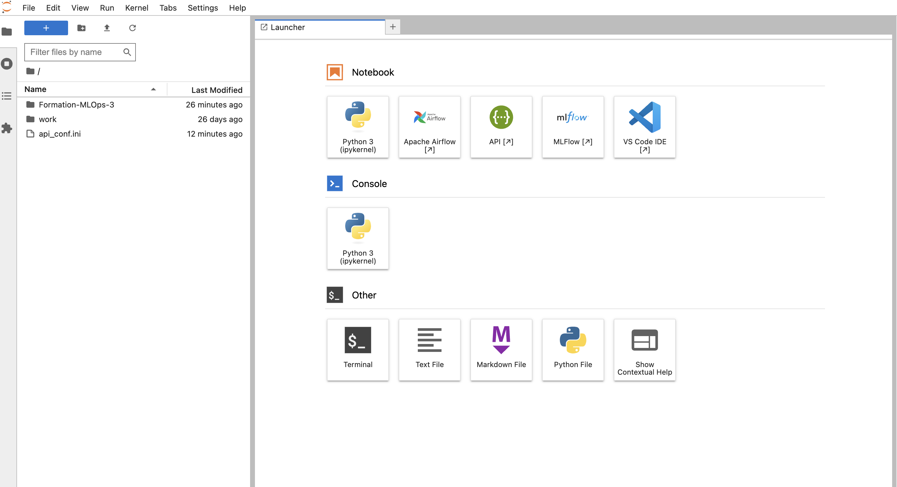

summary: TP0 - Setup de l'environnement de travail
id: tp0
categories: setup
tags: setup
status: Published
authors: OCTO Technology
Feedback Link: https://github.com/octo-technology/Formation-MLOps-3/issues/new/choose

# TP0 - Préparation de l'environnement de travail

## Vue d'ensemble

Duration: 0:01:00

### À l'issue de ce TP, vous aurez découvert

- L'environnement de TP
- Le repository de code que nous allons utiliser
- L'interface Swagger
- Les logs de l'API

## Prise en main de Jupyterhub, l'environnement de TP

Duration: 0:05:00

Pour vous connecter sur [l'interface de TP Jupyter Hub](https://lab.aws.octo.training/), l'instructeur vous aura donné
votre identifiant.


Une fois connecté, vous devrez définir votre mot de passe. 

Puis, une page de chargement apparaît, pendant que votre environnement de TP est créé :


Cela peut prendre 1 à 2 minutes, mais pas plus. Si votre environment ne démarre pas, vous pouvez essayer d'actualiser
puis faire appel à votre formateur.

Une fois que le serveur est démarré, vous êtes redirigé vers la page principale :


Depuis cette page, vous pouvez ouvrir :

- Un terminal : dans other / terminal
- Un éditeur de code en ligne : dans Notebook / VS Code
- Airflow et MLFlow que nous manipulerons

## Cloner le repo et découvrir la structure du TP

Duration: 0:03:00

Rendez-vous sur votre environnement de développement.

Ouvrez un terminal afin d'y cloner le repository de code des TPs avec la commande `$> git clone <url>;`.
Vous trouverez l'URL de clonage en HTTPS sur github, dans le repo que vous avez forké.

Pour ouvrir un terminal il faut cliquer sur en haut à gauche sur `File` puis `New` puis `Terminal`.


Une fois le repository clôné, un nouveau dossier apparaît.


Rentrer dans ce dossier à l'aide de la commande :

```shell
cd Formation-MLOps-3
```

En tapant la commande `git branch` vous pourrez constater que vous êtes sur la branche `0_initial_state`

Notre TP se déroulera en changeant de branche à chaque TP.

La commande suivante vous listera l'ensemble des branches du TP :

```shell
git branch -a
```

## Préparer l'environnement

Duration: 0:10:00

Ensuite, nous allons créer un environnement de travail Python avec Conda et installer les dépendances :

```bash
conda create -yqf python=3.10 --name mlops_3
source activate mlops_3
pip install -r requirements.txt
```

## Explorer le repository de code

Duration: 0:10:00

Avec les formateurs, ou seul, explorer le code existant pour prendre connaissance de l'état du projet.

Pour information, le code de l'API est organisé selon le
pattern [d'architecture hexagonale](https://blog.octo.com/architecture-hexagonale-trois-principes-et-un-exemple-dimplementation/)

Dans ce repository, vous avez une API minimaliste de ML :

```
   .
   ├── .github                # Des scripts de CI pour valider automatiquement les TPs (dédiés aux formateurs)
   ├── config                 # Différents fichiers de configurations pour faire tourner le TP
   ├── data                   # Contient le jeu de donnée brut utilisé pour le TP
   ├── models                 # Contient un modèle pré-entraîné
   ├── source                 # Contient le code source de l'API
   │   ├── api                # Les interfaces utilisateurs, ici des routes d'api
   │   ├── domain             # Le cœur métier
   │   │   ├── entities       # Des classes métiers
   │   │   ├── port           # Des classes abstraites pour interagir avec l'infrastructure
   │   │   ├── usecase        # Des orchestrateurs de tâches
   │   ├── infrastructure     # Le code pour interagir avec la base de donnée de monitoring et le registre de modèle
   ├── ...                    # Différents fichiers de config
   ├── run.py                 # Le script pour lancer l'API
```

## Accéder au Swagger de l'api

Duration: 0:05:00

Swagger est un langage de description d'interface permettant de décrire des API exprimées à l'aide de JSON.
Swagger est utilisé avec toute une série d'outils logiciels open source pour concevoir, créer, documenter et utiliser
des services Web.

Nous allons accéder à cette interface pour voir les routes d'API et interagir avec elles.

Pour pouvoir y accéder, nous devons faire une configuration liée à l'environnement de TP.

Ouvrir le fichier `/home/jovyan/api_conf.ini`, il contient deux sections de configuration :

```shell
[server] # Ce qui concerne notre serveur de TP
address = https://lab.aws.octo.training/jupyter/user/admin/swagger/  # TODO Remplacer admin par votre username (visible dans l'url)
python_path = python3 # TODO Insérer le path vers votre env conda (que vous pouvez trouver en tapant which python, le résultat sera sans doute /opt/conda/envs/mlops_3/bin/python)

[api] # Ce qui concerne le TP
run_dot_py_file_path = run.py  # TODO Insérer le path vers le fichier run.py du TP soit `Formation-MLOps-3/run.py`
```

Une fois cela fait, vous pouvez cliquer sur l'icône API dans le launcher, puis ajouter `/docs` à l'url pour voir le
swagger.

Tester la route `/health` pour vérifier que tout marche bien.

NB : En background, l'API a été lancé en auto reload, ce qui fait que toutes les modifications que l'on apportera
relanceront l'API.

Les logs de l'API sont visibles dans `/home/jovyan/api_logfile.log`

## Pour aller plus loin, apprendre à tuer l'API sur l'environnement de TP

Duration: 0:03:00

Comme l'API est lancé en background sur l'environnement de TP avec un port en particulier, `kill` l'API requiert
quelques manipulations.

#### Technique n°1 : redémarrer le server

L'autre option est de redémarrer votre server de TP :

1. Cliquer sur File >> Hub Control Panel >> Stop My Server
2. Start My Server

Tous les process ont été arrêtés.

#### Technique n°2 : en ligne de commande

Il faut tuer `uvicorn` avant ses workers.

Pour cela :

1. Avec la commande `ps -ef | grep python` trouver le processus qui contient `python3 Formation-MLOps-3/run.py`
2. Noter le PID (c'est le premier nombre de la ligne)
3. Exécuter la commande `kill -9 PID` cela va tuer le processus uvicorn qui va essayer de redémarrer, il n'y arrivera
   pas car le worker utilise encore le port
4.
    1. Trouver le (ou les) processus qui contien(ne)
       t `/opt/conda/bin/python3 -c from multiprocessing.spawn import spawn_main;`
    2. Le(s) tuer avec `kill -9 PID`
5. L'API va ainsi redémarrer.

## Lien vers le TP suivant

Duration: 0:01:00

Les instructions du TP suivant sont [ici](https://octo-technology.github.io/Formation-MLOps-3/tp1#0)
