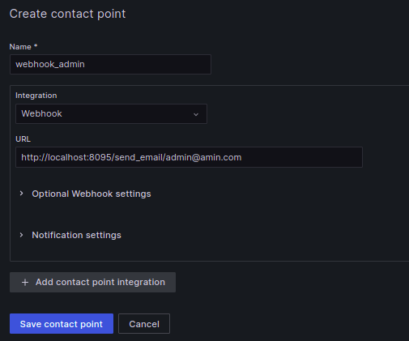
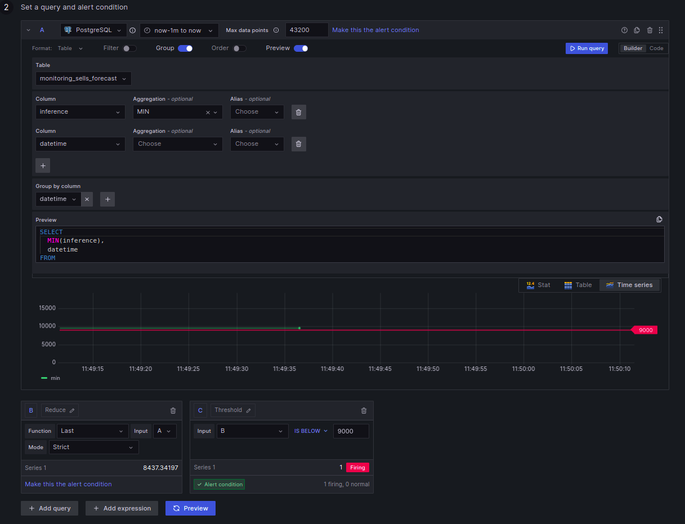
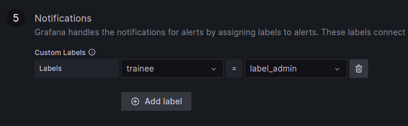
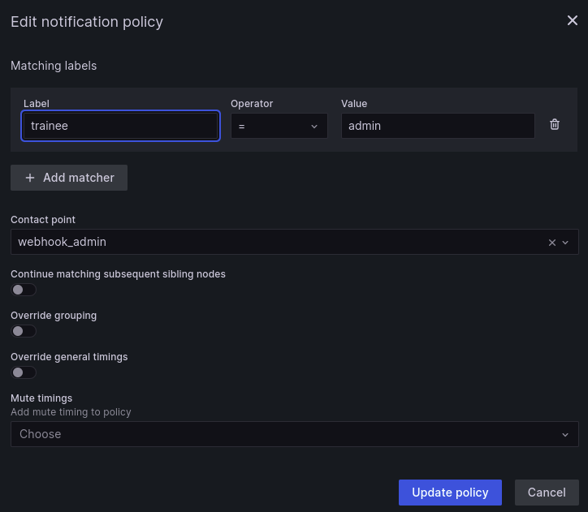
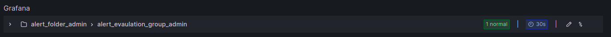
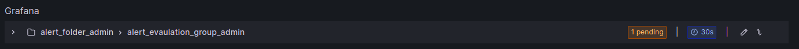
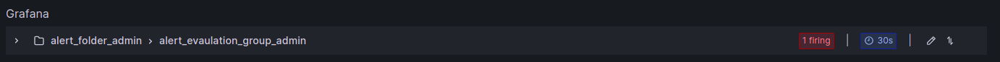

summary: TP4 - Envoyer automatiquement des alertes mail avec Grafana
id: tp4
status: Published
authors: OCTO Technology
Feedback Link: https://github.com/octo-technology/Formation-MLOps-3/issues/new/choose

# TP4 - Envoyer automatiquement des alertes mail avec Grafana

## Vue d'ensemble

Durée : 5 minutes

### À l'issue de ce TP, vous aurez découvert :

- Les différents éléments à configurer pour avoir une alerte pertinente
- La configuration d'alertes avec Grafana
- La gestion des notifications avec Grafana

Ce TP ne requiert pas de nouvelle branche, il se fait dans l'interface Grafana

## Créer un point de contact

Accéder à Grafana à l'adresse [https://lab.aws.octo.training/grafana/alerting](https://lab.aws.octo.training/grafana/alerting).

L'identifiant est collectif à tous les formés : `admin`.

Le mot de passe vous sera communiqué par le formateur.

Afin de créer une alerte, nous allons créer un point de contact dans Grafana.
Dans le cadre de ce TP, nous allons utiliser un webhook disponible au sein de notre infrastructure de TP.

1. Cliquer sur le menu déroulant en haut à gauche
2. Cliquer sur `Contact points` dans la section `Alerting`
3. Cliquer sur `Add contact point`
4. Dans `name`, fixer un nom unique `webhook_<votreprenom>`
5. Dans `Integration`, il est possible de s'intégrer à un serveur mail (SMTP), teams, slack, etc. Choisir dans le menu déroulant `webhook`.
6. Dans l'URL saisir http://localhost:8095/send_email/votreadresse@domain.com en remplaçant votreadresse@domain.com.
7. Cliquer sur `Test` pour vérifier que vous recevez bien le mail
8. Cliquer sur `Save contact point`

Maintenant que Grafana sait comment vous contacter, nous allons configurer quand vous contacter.

## Créer une règle d'alerte

Nous allons créer une règle pour déclencher des alertes.

1. Cliquer sur le menu déroulant en haut à gauche
2. Cliquer sur `Alert rules` dans la section `Alerting`
3. Cliquer sur `Create alert rule`
4. Dans `1 Set an alert rule name`, donner lui un nom : `alert_prenom`
5. Dans `2 Set a query and alert condition` :
    - Choisir une période de `now-5m to now` (Last five minutes) : nous allons nous intéresser uniquement aux 5 dernières
      minutes de données
    - Cliquez sur `Group`, les données vont être groupées par datetime
    - Dans `Table`, renseigner `monitoring_sells_forecast`
    - Dans `column`, sélectionner 2 colonnes : `inference` et `datetime`. Pour `inference`, choisir `Aggregation` `min`
    - Dans `Group by col`, grouper selon `datetime`
    - Dans `Threshold`, choisir `is below` `9000`
    - Cliquer sur `Preview` pour voir les alertes. Si aucun point ne s'affiche, retourner dans le Swagger pour demander une prédiction.

      Vous pouvez jouer sur les arguments pour déclencher une alerte (par exemple `age = 100` devrait permettre de la déclencher).
      
6. Dans `alert evaluation behavior`, nous allons configurer un groupe d'alertes et la durée au bout de laquelle elle se
   déclenche :
    - Dans `Folder`, choisir `add_new` et lui donner le nom `alert_folder_prenom`
    - Dans `Evaluation group`, renseigner `alert_evaluation_group_prenom`
    - Dans `Evaluation interval`, choisir `every 30s` (doit être un multiple de 10s). Il s'agit de la fréquence d'évaluation de l'alerte, il sera commun à toutes les alertes de cet `Evaluation group`
    - Dans `for`, choisir `30s`, c'est le délai pendant lequel le seuil doit être dépassé pour déclencher une alerte

   NB : Dans la "vraie" vie, les noms choisis seront explicites !
   
7. Finalement, nous allons configurer un label pour envoyer les notifications aux bonnes personnes.
    - Dans `Notifications`, `Labels`, `Choose key`, taper `trainee`
    - Dans `Choose value`, indiquer votre prénom

   
8. En haut à droite, cliquer sur `Save and exist`

Nous venons de créer une alerte. Il faut maintenant définir un envoi de mail pour cette alerte.

## Définir une notification policy

1. Cliquez sur le menu déroulant en haut à gauche
2. Cliquez sur `Notification policies` dans la section `Alerting`
3. Cliquez sur `New nested policy`
4. Dans le matching pattern, configuer `trainee` `=` `prenom`
5. Dans `Contact Point`, renseigner `webhook-prenom`

## Recevoir une alerte

Maintenant, nous allons chercher à avoir une alerte.

Dans la vue `Alert rule`, votre alerte apparaît comme normale :

Aller dans le Swagger et faire une requête (par exemple avec `age=100`) pour avoir une prédiction sous le seuil.

Attention, nous sommes tous sur la même table de monitoring des inférences, le comportement des autres formés peut avoir un impact sur vous.

Pour vous isoler, vous pouvez renommer la table de monitoring dans `source/infrastructure/database_monitoring_handler` dans la variable `MONITORING_SELLS_FORECAST`.

Retourner dans `alert rules` et vérifier que votre alerte devient `pending` (c'est-à-dire `a dépassé le seuil`, mais sur une durée inférieure à 30s)

Attendre un peu, elle va apparaître `firing`

Vérifier que vous avez bien reçu le mail d'alerte.

## Pour aller plus loin

En attendant le reste du groupe, vous pouvez créer une alerte sur l'âge.

## Lien vers le TP suivant

Les instructions du tp suivant sont [ici](https://octo-technology.github.io/Formation-MLOps-3/tp5#0)
