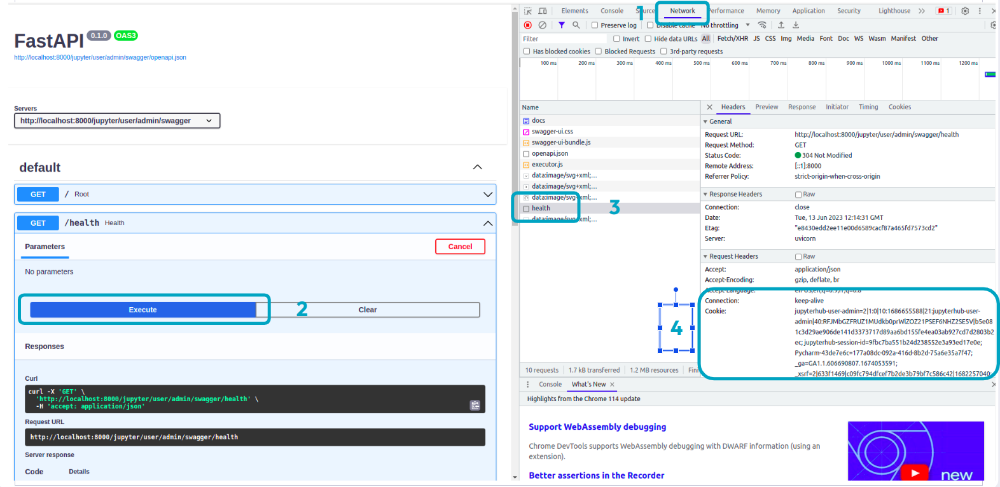
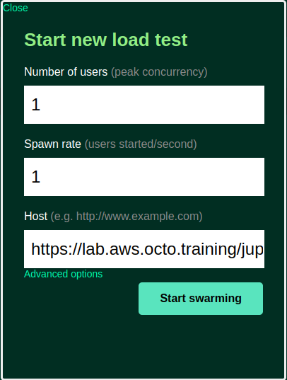

summary: TP6 - Réaliser un tir de performance sur l'API
id: tp6
status: Published
authors: OCTO Technology
Feedback Link: https://github.com/octo-technology/Formation-MLOps-3/issues/new/choose

# TP6 - Réaliser un tir de performance sur l'API

## Vue d'ensemble

Duration: 0:03:00

### À l'issue de ce TP, vous aurez découvert :

- Locust, un framework pour faire des tirs de performance
- La méthode pour créer des tests de performance

### Présentation des nouveautés sur la branche de ce TP

Récupérer la branche du TP :

```shell
git checkout 6_start_tp_tir_performance
```

Les nouveautés sur cette branche sont les suivantes :

- Le `requirements.txt` contient une nouvelle dépendance : `locust`
- Un fichier [locust.py](locust.py) qui contient un template de tir de performance

## Configuration de votre machine personnel

Duration: 0:05:00

Pour réaliser ce TP les tirs de performance se feront depuis votre PC personnel.

Pour cela :

1. Cloner le repository `git clone https://github.com/octo-technology/Formation-MLOps-3.git`
2. Entrer dans le dossier contenant le repository : `cd Formation-MLOps-3`
3. Installer locust en local `pip install locust`

## Ajouter l'authentification pour réaliser vos tirs de performance

Duration: 0:05:00

Pour pouvoir faire un tir de performance sur une machine déployée, il faut s'authentifier

Dans le cas de notre machine de TP, l'authentification se fait avec un header `Cookie`, nous allons le récupérer dans
notre navigateur :

1. Aller sur l'interface Swagger utilisée dans les TPs précédents
2. Clic droit, inspecter
3. Aller dans l'onglet `Network` qui est apparu
4. Lancer une requête en remplaçant `/docs` par `/health` dans l'URL
5. Cliquer sur la requête `health` qui est apparue
6. Dans Request Headers copier le contenu de `Cookie`
7. Le coller dans la variable `YOUR_COOKIE` dans `locustfile.py`



## Lancer le tir de performance

Duration: 0:05:00

Pour lancer le tir de performance :

1. Dans votre terminal, taper `locust`
2. Accéder à [http://0.0.0.0:8089](http://0.0.0.0:8089)
   Vous verrez alors l'interface de configuration suivante :
   
3. Pour configurer :
    - Number of user : nombre d'utilisateurs simulés. Commençons par `10`.
    - Spawn rate : nombre de créations d'utilisateurs par seconde. Commençons par `1`.
    - Host : route du server sur lequel faire le test. `https://lab.aws.octo.training/jupyter/user/admin/swagger/`
       ⚠️ Remplacer `admin` par votre user.
4. Cliquer sur start swarming.
5. Verifier que cela fonctionne :
    - Est-ce que les appels finissent en succès ?
    - Dans le fichier de log `api_logfile.log` sur le lab, est-ce que les appels apparaissent ?

## Faire des tirs de performance sur la route predict

Duration: 0:10:00

1. Modifier le fichier `locustfile.py` en remplaçant l'appel sur la route `/health` par un appel sur la route `/predict` avec les bons query parameters.

   Par exemple : `/predict?education=PhD&age=12&income=1000`

2. Arrêter et relancer locust dans votre terminal
3. Réaliser un test de performance
4. Jouer sur le nombre d'utilisateurs pour tirer des conclusions sur le fonctionnement de la route et ses limites.

## Auditer le code de predict et l'améliorer

Duration: 0:10:00

Parcourir le code de prediction et trouver des améliorations pour accélérer la route.

Implémentez votre idée, et réaliser un nouveau tir de performance pour vérifier le résultat.

Si vous n'avez pas d'idée, voir la section d'après.

## Si vous n'avez pas d'idée pour accélérer

Duration: 0:03:00

Comme idée d'amélioration, nous vous proposons :

1. De charger le modèle au mariage de l'application plutôt qu'à chaque prédiction.
2. D'augmenter le nombre de worker de votre API. Avec l'argument `workers` de `uvicorn.run`.
    - Attention, il faut désactiver auto-reload pour que cela ait un effet.
    - Attention, les modifications sur le fichier run.py concernent uvicorn, le `reload` n'aura pas d'impact. Il faut killer toute l'API.

## Pour aller plus loin

Duration: 0:00:00

Avec des tirs de performance as-code, il est possible de configurer de nombreux scenarios.

- Explorer la documentation de [locust](https://docs.locust.io/en/stable/writing-a-locustfile.html)
- Changer l'implémentation de notre tir de performance pour générer aléatoirement les variables âge et éducation.

## Lien vers le TP suivant

Duration: 0:01:00

Les instructions du TP suivant sont [ici](https://octo-technology.github.io/Formation-MLOps-3/tp7#0)
