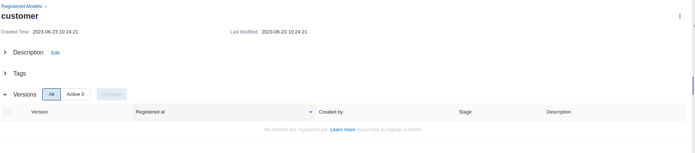
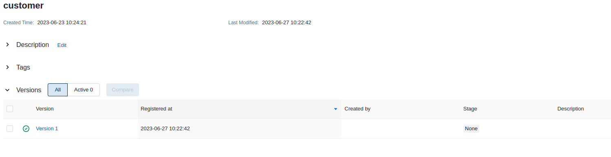

summary: TP7 - Changer de modèle de ML
id: tp7
status: Published
authors: OCTO Technology
Feedback Link: https://github.com/octo-technology/Formation-MLOps-3/issues/new/choose

# TP7 - Changer de modèle de ML

## Vue d'ensemble

Duration: 0:02:00

### À l'issue de ce TP, vous aurez découvert :

- Le registre de modèle de MLFlow
- Mettre en place des versions d'une route d'API

### Présentation des nouveautés sur la branche de ce TP

Récupérer la branche du TP :

```shell
git checkout 7_start_tp_change_model
```

Les nouveautés sont :

- La route de `predict` est maintenant `/v1/predict`
- La route de `predict` requiert un query parameter `model` qui doit être soit `production`, soit `staging`.

## Enregistrer le modèle actuel sur MLFlow

Duration: 0:10:00

### Créer un modèle dans le registre
Jusqu'à maintenant, le code d'inférence chargeait un model sauvegardé localement, le code de chargement est le suivant :

```python
try:
   model = mlflow.pyfunc.load_model(model_uri=f"models:/customer/{model}")
   logging.info('Successfully loaded model from MLflow')
   return model
except MlflowException:
   logging.info('Failed to load model from MLflow, loading default model')
   return joblib.load(MODEL_PATH)
```

Si le code ne parvient pas à charger le modèle, il charge le modèle local.

Nous allons configurer MLflow, pour qu'il puisse charge le modèle actuel :

1. Se rendre dans l'interface MLflow (à partir de la page d'accueil de jupyterhub)
2. Aller dans l'onglet `Models`
3. Cliquer sur `Create Model`
4. Donner le nom `customer` (ce nom correspond au nom utilisé dans le `mlflow.pyfunc.load_model`)
5. Cliquer sur `create`
6. Maintenant cliquer sur le modèle `customer` qui apparaît à l'écran.



### Enregistrer un modèle entraîné
Le modèle étant vide, nous allons enregistrer le résultat du dernier entraînement comme modèle associé :

1. Aller dans l'onglet `Experiments`
2. Cliquer sur la dernière expérimentation (s'il n'y en a pas, lancer un `train` dans le Swagger)
3. Dans la section `Artifacts`, cliquer sur `Register Model`
4. Sélectionner dans le menu déroulant le modèle `customer`
5. Cliquer sur `register`
6. Retourner dans l'onglet `Models` et cliquer sur `customer`, apparaît alors une version du modèle :



### Promouvoir le modèle en production
Maintenant qu'une version du modèle existe, nous allons le promouvoir en `Production`:

1. Cliquer sur la `version 1`
2. Dans `stage` cliquer sur le menu déroulant, choisir `transition to Production`
3. Cliquer sur `ok`

Nous avons alors un modèle en production, vérifions que cela fonctionne :

1. Réaliser une prédiction dans le Swagger
2. Aller regarder dans le fichier `api_logfile.log` que la log indique 'Successfully loaded model from MLflow'


## Réaliser un nouvel entraînement et mettre le modèle en staging

Duration: 0:05:00

Nous allons entraîner un nouveau modèle, puis le mettre en staging pour le valider.

1. Dans le Swagger lancer la route `/train` pour faire un entraînement
2. Dans l'interface MLflow, onglet `Experiments` trouver cette expérimentation, enregistrer le modèle sur `customer`
3. Dans l'interface `Models` promouvoir le nouveau modèle en `staging`
4. Dans le Swagger faire un appel à la route `/predict` avec pour modèle `staging` pour vérifier que le modèle est
   fonctionnel.

## Pour aller plus loin : construire un modèle qui change le contrat d'interface

Duration: 0:00:00

En attendant le reste du groupe, explorer comment réaliser un changement de contrat d'interface.

Constatant que la variable `income` est peu impactante, le métier nous demande de mettre à jour le modèle et l'API pour
ne plus utiliser cette variable.

1. Entraîner un modèle qui n'utilise plus la variable `income`
2. Développer une route d'api `v2/predict` qui n'accepte pas l'argument `income`
3. Récupérer le bon modèle pour faire la prédiction.


## Lien vers le TP suivant

Duration: 0:01:00

Les instructions du TP suivant sont [ici](https://octo-technology.github.io/Formation-MLOps-3/tp8#0)